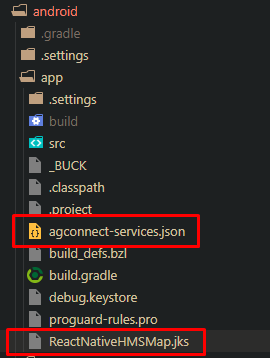
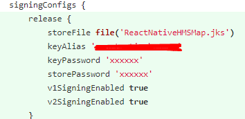

# React Native - HMS Map Kit Integration

## Getting Started


### Pre-requisites

Node.JS ( and npm ) should be installed.
Android SDK should be installed. ( Preferrably Android Studio )
Platform-tools and build-tools of the Android SDK should be added to the $PATH variable.
Developer options should be enabled on your phone, and debug option should be enabled.

### 1. HMS Map Library 
Library : [https://git.huawei.com/hms-core/react-native/react-native-hms-map](https://git.huawei.com/hms-core/react-native/react-native-hms-map)

Demo : [https://git.huawei.com/hms-core/react-native/react-native-hms-map-demo](https://git.huawei.com/hms-core/react-native/react-native-hms-map-demo)

Git clone these repos.

### 2. Installing the dependencies
  
  1.  Enter demo app "react-native-hms-map-demo"
  2.  Install dependencies
```bash
npm i
--OR--
yarn
```

### 3. Copy the library into the demo project

In order to able the library to be used in the demo, the library should be copied under the node_modules folder of the project.

 Copy "react-native-hms-map" folder into "node_modules" folder.

The structure should be like this

            react-native-hms-map-demo
                |_ node_modules
                    |_ ...
                        react-native-hms-map
                        ...

### 4. Integration HMS Core

There are two files required that are "agconnect-services.json" and "xxx.jks" files.

Prepare these files and put these into ./android/app/



Follow these steps for generating these files.

[https://git.huawei.com/hms-core/documents/blob/master/DOCUMENTS/INTEGRATION%20HMS%20CORE.MD](https://git.huawei.com/hms-core/documents/blob/master/DOCUMENTS/INTEGRATION%20HMS%20CORE.MD)

### 5. Signing Configs

After create "agconnect-services.json" and "xxx.jks" files, you have to signing configs.
So open "/android/app/build.gradle"



### 6. Run the project

Open a command line of your choice, and run the following command in order to run the project. 

```bash
npm run android
```


## Library Overview

There are 7 Components that react-native-hms-map supports that are MapView, Marker, Callout, Polygon, Polyline, Circle and Overlay.

### 1. < MapView /> Component API

Examples of MapView Component in ./App.js

Supported props:
- region
- initialRegion
- camera
- initialCamera
- showCompass
- showsBuildings
- zoomEnabled
- zoomControlEnabled
- minZoomLevel
- maxZoomLevel
- rotateEnabled
- scrollEnabled
- pitchEnabled

Supported events:
- onMapReady
- onRegionChange
- onRegionChangeComplete
- onPress
- onDoublePress
- onPanDrag
- onLongPress
- onMarkerPress
- onCalloutPress
- onMarkerDragStart
- onMarkerDrag
- onMarkerDragEnd

Supported methods:
- getCamera
- setCamera
- getMapBoundaries
- setMapBoundaries
- fitToElements
- fitToSuppliedMarkers
- fitToCoordinates
- pointForCoordinate
- coordinateForPoint


### 2. < Marker /> Component API

Examples of Marker Component in ./MarkersExample.js

Supported props:
- title
- description
- image
- icon
- pinColor
- coordinate
- anchor
- calloutAnchor
- flat
- identifier
- rotation
- draggable
- tracksViewChanges
- opacity

Supported events:
- onPress
- onCalloutPress
- onDragStart
- onDrag
- onDragEnd

Supported methods:
- showCallout
- hideCallout
- redrawCallout
- animateMarkerToCoordinate
- redraw


### 3. < Callout /> Component API

Examples of Callout Component in ./MarkersExample.js

Supported props:
- tooltip
- alphaHitTest

Supported events:
- onPress


### 4. < Polygon /> Component API

Examples of Polygon Component in ./PolygonsExample.js

Supported props:
- coordinates
- holes
- strokeWidth
- strokeColor
- fillColor
- geodesic
- tappable

Supported events:
- onPress

### 5. < Polyline /> Component API

Examples of Polyline Component in ./PolylinesExample.js

Supported props:
- coordinates
- strokeWidth
- strokeColor
- geodesic
- tappable

Supported events:
- onPress

### 6. < Circle /> Component API

Examples of Circle Component in ./CirclesExample.js

Supported props:
- center
- radius
- strokeWidth
- strokeColor
- fillColor
- zIndex
- geodesic

### 7. < Overlay /> Component API

Examples of Overlay Component in ./OverlaysExample.js

Supported props:
- image
- bounds
- tappable

Supported events:
- onPress
